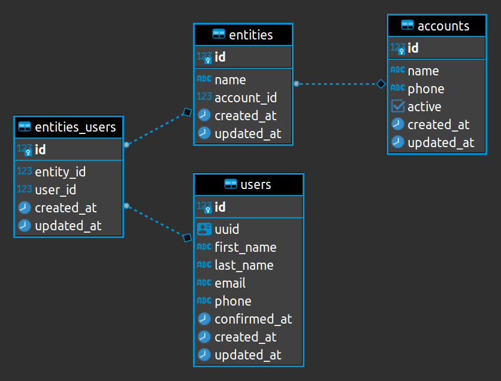

# Desafio Back-end :desktop_computer:

Olá! :wave: Este é o primeiro contato com um pouco da nossa realidade. Nele você vai conhecer alguns dos problemas que resolvemos.

## Introdução

O nosso desafio consiste dos seguintes entregáveis:

* refatoração do código de criação de conta, que está complexo
* criação de testes unitários para os trechos de código que estão sem cobertura
* criação de duas novas funcionalidades

Para entregar o desafio, faça um clone desse repositório, e nos envie por e-mail o link dele.

Dicas:

* não pule a leitura desse README, algo muito importante no nosso dia-a-dia é a atenção, ler código, documentação, tarefas, etc. Sair fazendo na maioria das vezes, acaba causando mais problemas, do que soluções. Portanto, pegue um café/bebida de sua preferência e vá com calma :)
* ficou em dúvida sobre algum ponto? Só nos mandar um e-mail
* procure quebrar os entregáveis em pequenas tarefas, para evitar uma eventual ["Analysis paralysis"](https://en.wikipedia.org/wiki/Analysis_paralysis)
* dê uma olhada no nosso [Playbook](https://github.com/Myfc-github/playbook), lá explicamos "nosso jeito" de desenvolver
* ao entregar o desafio, fique livre para adicionar neste README.md ou criar algum outro markdown para complementar algo sobre o desafio (isso é totalmente opcional)

## Entregáveis

1. Refatoração do código de criação de conta. De acordo com o seu conhecimento, avalie o código e realize uma refatoração com o objetivo de diminuir a complexidade atual
2. Deixamos alguns trechos do código sem cobertura, cabe a você descobrir quais pontos são e adicionar os novos testes
3. Criação de duas novas funcionalidades:

    - Hoje a criação de uma conta, também inclui o cadastros dos usuários, desta forma UMA conta pode ter N usuários, e UM usuário pertence a UMA conta. Porém um novo requisito chegou: alguns dos nossos clientes têm mais de uma empresa, e precisam que os seus usuários possam acessar diferentes empresas. Portanto, precisamos ter um cadastro único de usuários, e esses usuários estarem relacionados as empresas (chamadas de `entities`), e não mais a conta em si (diagrama de como é esperado ficar está abaixo).
    - Estamos falando com alguns parceiros, que irão nos ajudar a adquirir novos clientes. Eles hoje usam o [SQS](https://aws.amazon.com/sqs/) para realizar essa comunicação. Precisamos criar um consumidor que receba as mensagens de uma fila, e siga com de criação de conta já existente. O payload que será enviado é o mesmo payload JSON que recebemos via API REST. Chegamos a criar uma suíte de teste com dois contextos e o exemplo do payload em: `spec/workers/new_registation_worker_spec.rb`

## Entregável extra

Deixamos na aplicação vários pontos que podem ser refatorados, se identificar e quiser arrumar, conta como um bônus. Na próxima entrevista, também iremos abordar esse ponto, portanto se quiser apenas comentar sobre eles, tudo bem.

## Setup

Você precisa:
 * docker
 * docker-compose
 * ruby 3.0.2

Para iniciar o container do PostgreSQL, basta rodar na raíz do projeto: `docker-compose up`

Crie um arquivo `.env` e atualize as variáveis que precisam ser definidas: `cp .env.example .env`

Já para iniciar a aplicação: `foreman start`

## Testes

O desafio back-end permite execução da suite de testes em paralelo, através da gem `parallel_tests`, para melhor performance. Para executar a suite de testes:

1. Prepare o banco de dados de teste

        rails db:test:prepare

2. Gere os bancos de dados de teste a serem utilizados para cada processo em paralelo (o comando gera X banco de dados, onde X é de acordo com o número de CPUs do seu computador):

        rails parallel:create

3. Execute os testes (o comando abaixo dispara as suites de testes em paralelo usando 4 processos):

        COVERAGE=true parallel_rspec spec -n 4

4. Verifique o resultado dos testes no arquivo

        ./coverage/index.html

## Rubocop

Para rodar o rubocop, rode: `rubocop --parallel`
